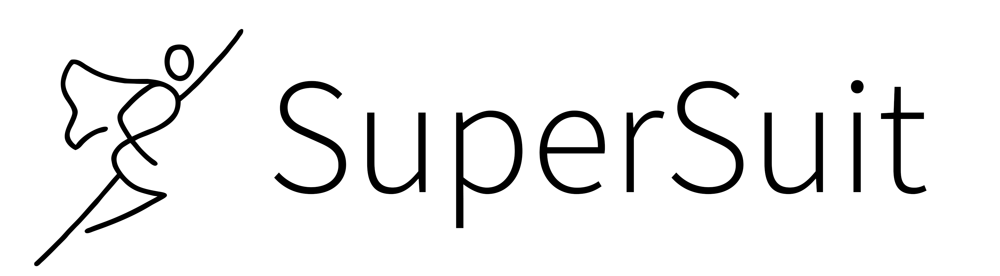

<p align="center">
    
</p>

[](https://travis-ci.com/PettingZoo-Team/SuperSuit)

SuperSuit introduces a collection of small functions which can wrap reinforcement learning environments to do preprocessing ('microwrappers').
We support Gym for single agent environments and PettingZoo for multi-agent environments. Using it to convert space invaders to have a grey scale observation space and stack the last 4 frames looks like:

```
import gym
from supersuit import color_reduction, frame_stack

env = gym.make('SpaceInvaders-v0')

env = frame_stack(color_reduction(env, 'full'), 4)
```

Similarly, using SuperSuit with PettingZoo environments looks like

```
from pettingzoo.butterfly import pistonball_v0
env = pistonball_v0.env()

env = frame_stack(color_reduction(env, 'full'), 4)
```

You can install SuperSuit via `pip install supersuit`

## Included Functions

`clip_reward(env, lower_bound=-1, upper_bound=1)` clips rewards to between lower_bound and upper_bound. This is a popular way of handling rewards with significant variance of magnitude, especially in Atari environments.

`clip_actions(env)` clips Box actions to be within the high and low bounds of the action space. This is a standard transformation applied to environments with continuous action spaces to keep the action passed to the environment within the specified bounds.

`color_reduction(env, mode='full')` simplifies color information in graphical ((x,y,3) shaped) environments. `mode='full'` fully greyscales of the observation. This can be computationally intensive. Arguments of 'R', 'G' or 'B' just take the corresponding R, G or B color channel from observation. This is much faster and is generally sufficient.

`dtype(env, dtype)` recasts your observation as a certain dtype. Many graphical games return `uint8` observations, while neural networks generally want `float16` or `float32`.

`flatten(env)` flattens observations into a 1D array.

`frame_skip(env, num_frames, seed=None)` skips `num_frames` number of frames by reapplying old actions over and over. Observations skipped over are ignored.  Like Gym Atari's frameskip parameter, `num_frames` can also be a tuple `(min_skip, max_skip)`, which indicates a range of possible skip lengths which are randomly chosen from (in single agent environments only).

`delay_observations(env, delay, seed=None)` Delays observation by `delay` frames. Before `delay` frames have been executed, the observation is all zeros. Along with frame_skip, this is the preferred way to implement reaction time for high FPS games.

`sticky_actions(env, repeat_action_probability, seed=None)` assigns a probability of an old action "sticking" to the environment and not updating as requested. This is to prevent agents from learning predefined action patterns in highly deterministic games like Atari. Note that the stickiness is cumulative, so an action has a repeat_action_probability^2 chance of an action sticking for two turns in a row, etc. This is the recommended way of adding randomness to Atari by *"Machado et al. (2018), "Revisiting the Arcade Learning Environment: Evaluation Protocols and Open Problems for General Agents"*

`frame_stack(env, num_frames=4)` stacks the most recent frames. For vector games observed via plain vectors (1D arrays), the output is just concatenated to a longer 1D array. 2D or 3D arrays are stacked to be taller 3D arrays. At the start of the game, frames that don't yet exist are filled with 0s. `num_frames=1` is analogous to not using this function.

`normalize_obs(env, env_min=0, env_max=1)` linearly scales observations to be 0 to 1, given known minimum and maximum observation values. Only works on Box observations with finite bounds.

`reshape(env, shape)` reshapes observations into given shape.

`resize(env, x_size, y_size, linear_interp=False)` Performs interpolation to up-size or down-size observation image using area interpolation by default. Linear interpolation is also available by setting `linear_interp=True` (it's faster and better for up-sizing). This wrapper is only available for 2D or 3D observations, and only makes sense of the observation is an image.


## Included Multi-Agent Only Functions

`agent_indicator(env, type_only=False)` Adds an indicator of the agent ID to the observation, only supports discrete and 1D, 2D, and 3D box. For 1d spaces, the agent ID is converted to a 1-hot vector and appended to the observation (increasing the size of the observation space as necessary). 2d and 3d spaces are treated as images (with channels last) and the ID is converted to *n* additional channels with the channel that represents the ID as all 1s and the other channel as all 0s (a sort of one hot encoding). This allows MADRL methods like parameter sharing to learn policies for heterogeneous agents since the policy can tell what agent it's acting on. Set the `type_only` parameter to parse the name of the agent as `<type>_<n>` and have the appended 1-hot vector only identify the type, rather than the specific agent name. This is useful for games where there are many agents in an environment but few types of agents. Agent indication for MADRL was first introduced in *Cooperative Multi-Agent Control Using Deep Reinforcement Learning.*

`pad_action_space(env)` pads the action spaces of all agents to be be the same as the biggest, per the algorithm posed in *Parameter Sharing is Surprisingly Useful for Deep Reinforcement Learning*.  This enables MARL methods that require homogeneous action spaces for all agents to work with environments with heterogeneous action spaces. Discrete actions inside the padded region will be set to zero, and Box actions will be cropped down to the original space.

`pad_observations(env)` pads observations to be of the shape of the largest observation of any agent with 0s, per the algorithm posed in *Parameter Sharing is Surprisingly Useful for Deep Reinforcement Learning*. This enables MARL methods that require homogeneous observations from all agents to work in environments with heterogeneous observations. This currently supports Discrete and Box observation spaces.

## Environment Vectorization

These functions turn plain Gym environments into vectorized environments, for every common vector environment spec.

`gym_vec_env(env, num_envs, multiprocessing=False)` creates a Gym vector environment with `num_envs` copies of the environment. If `multiprocessing` is True, AsyncVectorEnv is used instead of SyncVectorEnv.

`stable_baselines_vec_env(env, num_envs, multiprocessing=False)` creates a stable_baselines vector environment with num_envs copies of the environment. If `multiprocessing` is True, SubprocVecEnv is used instead of DummyVecEnv. Needs stable_baselines to be installed to work.

`stable_baselines3_vec_env(env, num_envs, multiprocessing=False)` creates a stable_baselines vector environment with num_envs copies of the environment. If `multiprocessing` is True, SubprocVecEnv is used instead of DummyVecEnv. Needs stable_baselines3 to be installed to work.

#### Note on multiprocessing
Turning on multiprocessing runs each environment in it's own process. Turning this on is typically much slower for fast environments (like card games), but much faster for slow environments (like robotics simulations). Determining which case you are will require testing.

## Lambda Functions

If none of the included in micro-wrappers are suitable for your needs, you can use a lambda function (or submit a PR).

`action_lambda(env, change_action_fn, change_space_fn)` allows you to define arbitrary changes to the actions via `change_action_fn(action, space) : action` and to the action spaces with `change_space_fn(action_space) : action_space`. Remember that you are transforming the actions received by the wrapper to the actions expected by the base environment.

`observation_lambda(env, observation_fn, observation_space_fn=None)` allows you to define arbitrary changes to the via `observation_fn(observation) : observation`, and `observation_space_fn(obs_space) : obs_space`. For Box-Box transformations the space transformation will be inferred from `change_observation_fn` if `change_obs_space_fn=None` by passing the `high` and `low` bounds through the `observation_space_fn`.

`reward_lambda(env, change_reward_fn)` allows you to make arbitrary changes to rewards by passing in a `change_reward_fn(reward) : reward` function. For Gym environments this is called every step to transform the returned reward. For AECEnv, this function is used to change each element in the rewards dictionary every step.

### Lambda Function Examples

Adding noise to a Box observation looks like:

```
env = observation_lambda(env, lambda x : x + np.random.normal(size=x.shape))
```

Adding noise to a box observation and increasing the high and low bounds to accommodate this extra noise looks like:

```
env = observation_lambda(env,
    lambda x : x + np.random.normal(size=x.shape),
    lambda obs_space : gym.spaces.Box(obs_space.low-5,obs_space.high+5))
```

Changing 1d box action space to a Discrete space by mapping the discrete actions to one-hot vectors looks like:

```
def one_hot(x,n):
    v = np.zeros(n)
    v[x] = 1
    return v

env = action_lambda(env,
    lambda action, act_space : one_hot(action, act_space.shape[0]),
    lambda act_space : gym.spaces.Discrete(act_space.shape[0]))
```

## Release History

Version 1.1.0 (August 17th, 2020):

Adds action clipping

Version 1.0.0 (August 5th, 2020):

This is the first official stable release of SuperSuit. We don't have any further features planned at this time, but we're going to keep maintaining it and adding functionality as new things become standard.


## Reward Program

We have a sort bug/documentation error bounty program, inspired by [Donald Knuth's reward checks](https://en.wikipedia.org/wiki/Knuth_reward_check). People who make mergable PRs which properly address meaningful problems in the code, or which make meaningful improvements to the documentation, can recieve a negotiable check for "hexadecimal dollar" ($2.56) mailed to them, or sent to them via PayPal. To redeem this, just send an email to justinkterry@gmail.com with your mailing adress or PayPal adress. We also pay out 32 cents for small fixes.
